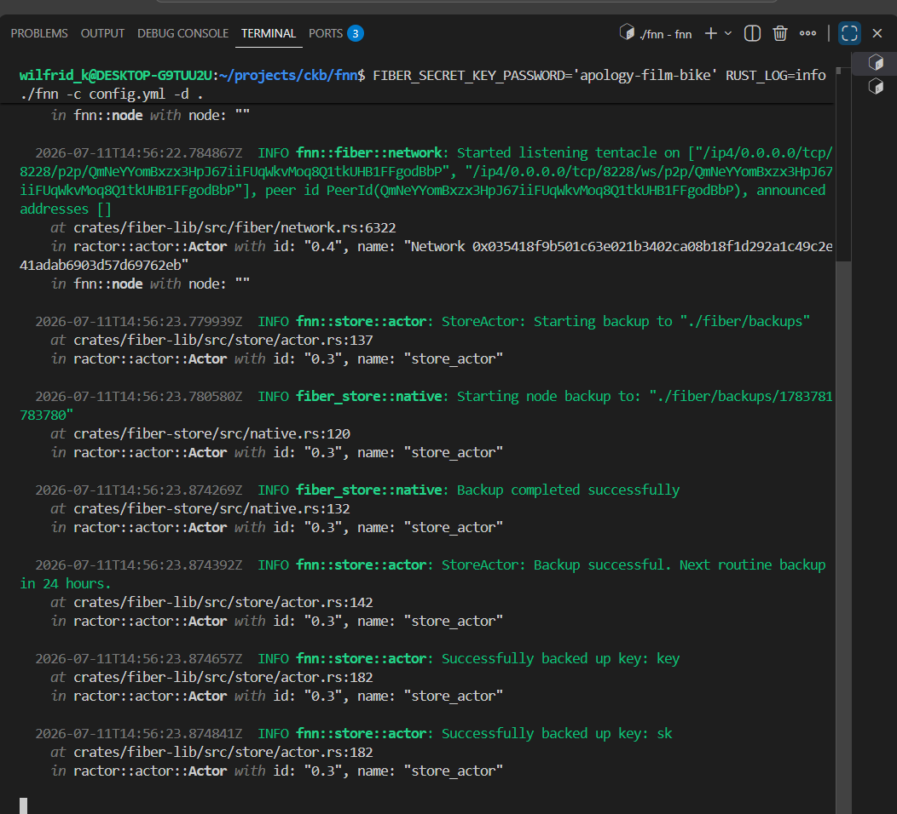
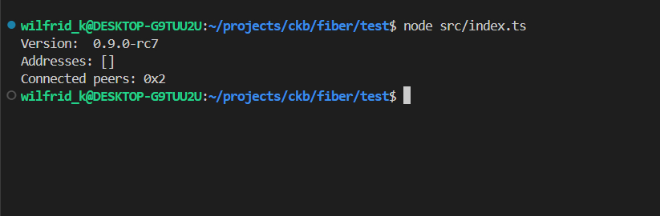

## SUMMARY

### Setting up a Local Fiber Network Node

This week was about getting hands-on with Fiber — not just reading about it, but actually running a node and querying it programmatically using the JavaScript SDK.

---

### Running the fnn Binary

The Fiber Network Node ships as a single binary, `fnn`, alongside a CLI companion, `fnn-cli`. Getting it running required a `config.yml` and a base directory. The config specifies three services that run together:

- **ckb** — connects to the CKB testnet via a public RPC endpoint (`https://testnet.ckbapp.dev/`), so no local CKB node is needed
- **fiber** — the P2P payment channel layer, listening on port `8228`
- **rpc** — a JSON-RPC server on `127.0.0.1:8227` for controlling the node

The command to start the node is:

```bash
FIBER_SECRET_KEY_PASSWORD='<password>' RUST_LOG=info ./fnn -c config.yml -d .
```

The `-d .` flag sets the base directory to the current folder. With the password set, fnn expects an encrypted secret key at `./ckb/key.encrypted` and the Fiber P2P key at `./fiber/sk`.

---

### The Key Setup Problem

Getting the node to start cleanly took some debugging. There were two distinct errors before it worked.

**First error — with the password set:**

```
thread 'main' panicked at crates/fiber-lib/src/utils/encrypt_decrypt_file.rs:48:37:
called `Result::unwrap()` on an `Err` value: Os { code: 2, kind: NotFound, message: "No such file or directory" }
```

**Second error — without the password:**

```
Error: Secret key file error: please set FIBER_SECRET_KEY_PASSWORD environment variable
to encrypt and decrypt the secret key
```

The two errors together revealed the actual picture. The CKB actor and the Fiber actor use separate keys stored in separate subdirectories:

| Subdirectory | File | Purpose |
|---|---|---|
| `./fiber/` | `sk` | Fiber P2P identity key (raw 32-byte binary) |
| `./ckb/` | `key` or `key.encrypted` | CKB signing key (hex, then encrypted) |

The `./ckb/` directory was empty. The plain CKB key (`key`) was sitting at the root of the working directory instead of inside `./ckb/`. Once the key was copied into place:

```bash
cp ./key ./ckb/key
```

Running with the password set caused fnn to auto-migrate the plain key to encrypted format — it logs `"secret key is using plain key format, start migrating to encrypted format"`, writes `./ckb/key.encrypted`, and removes the plain `./ckb/key`. From that point on, the password is always required at startup.

The node started successfully after that.



---

### Interacting with the Node via `fnn-cli`

With the node running, `fnn-cli` connects to the RPC on `127.0.0.1:8227` by default. The basic commands are:

```bash
# Node info — version, peer ID, addresses
./fnn-cli info

# List connected peers
./fnn-cli peer list

# List open channels
./fnn-cli channel list
```

The node exposes the full lifecycle of a payment channel:

1. Fund a CKB address (the node's wallet is derived from `./ckb/key.encrypted`)
2. Open a channel with a peer (`./fnn-cli channel open ...`)
3. Send payments over the channel (`./fnn-cli payment send ...`)
4. Close the channel to settle back on-chain

Testnet CKB is available from the [CKB testnet faucet](https://faucet.nervos.org/) — needed before opening any channels.

---

### Querying the Node with the JavaScript SDK

The second part of the week was testing the `@ckb-ccc/fiber` SDK against the running node. The test project is a minimal TypeScript setup:

```typescript
import { FiberSDK } from "@ckb-ccc/fiber"

const sdk = new FiberSDK({
    endpoint: "http://127.0.0.1:8227",
    timeout: 5000,
})

const info = await sdk.getNodeInfo();
console.log("Version: ", info.version)
console.log("Addresses:", info.addresses);
console.log("Connected peers:", info.peersCount);
```

Running this against the live node worked after fixing a packaging bug in the canary build of `@ckb-ccc/fiber`. The published version (`0.0.0-canary-20260330023358`) has three files in its `dist/types/` directory that use extensionless relative imports:

```js
// channel.js, invoice.js, payment.js — all had this:
import { toHex } from "../utils";   // ❌ breaks under Node ESM

// needed this:
import { toHex } from "../utils.js"; // ✓
```

Node.js ESM requires explicit `.js` extensions in relative imports — the TypeScript compiler emits them correctly, but this canary build was published without them. The fix was a targeted `sed` against those three files in `node_modules`. After that the imports resolved and the SDK connected to the node cleanly.



---

### What's Next

The node is running and queryable. The next logical steps are:

- Fund the node's CKB address from the testnet faucet
- Open a channel with one of the bootstrap peers from the config
- Send a test payment end-to-end
- Explore what the graph looks like (`./fnn-cli graph channels`) — who is already on the testnet network and how interconnected it is

Understanding the network topology and what liquidity already exists will shape whatever gets built on top, but I will not participate in this hackathon. Instead, I will bide my time, and wait for the products Hackathon, not infra Hackathon
