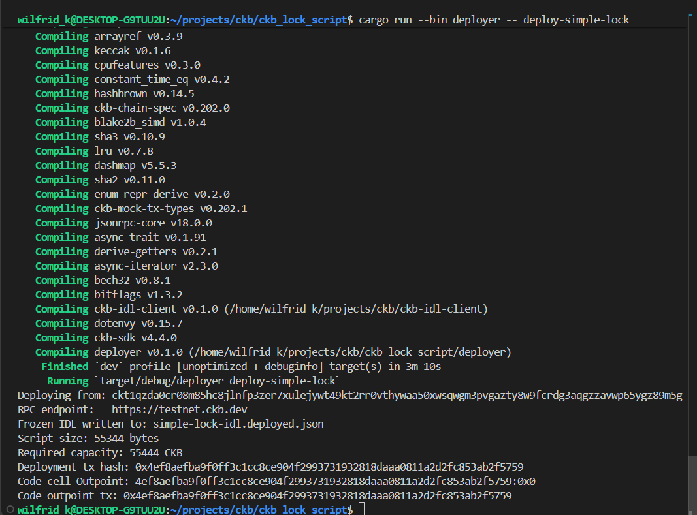
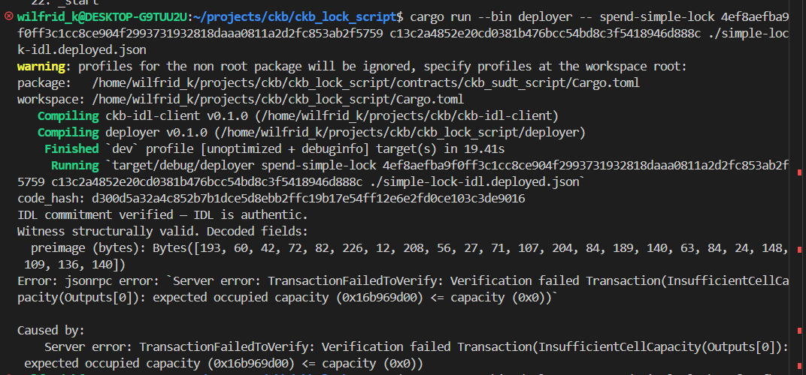

# Weekly Progress Report
## Week 13: Running the Full IDL-Driven Spend Flow on Testnet

Week 12 ended with a clear plan: add `ckb-idl-client` as a dependency of the deployer, write a `spend.rs` binary, and run the full flow against testnet. This week that plan was executed — including several real deployments to CKB testnet and a significant amount of debugging that exposed genuine design issues worth documenting.

---

### What Was Built

The `deployer` crate now has two commands beyond the original `deploy-sudt`:

**`deploy-simple-lock`** — Deploys the `simple-lock` contract binary to CKB testnet. The key addition this week: before deploying, it reads `contracts/simple-lock/idl.json`, computes a SHA-256 hash of those exact bytes, and appends the 32-byte hash to the end of the script binary. The deployed code cell therefore contains `[binary][idl_commitment]`. After deployment, the exact IDL bytes used are written to a frozen file at the workspace root named `simple-lock-idl.deployed.json`. This frozen file is the source of truth for future `verify()` calls.

**`spend-simple-lock`** — The full PSCT demonstration. It accepts three CLI arguments: the tx hash of the code cell outpoint, a hex-encoded preimage, and a path to the IDL file. It then:
1. Fetches the code cell data from chain and derives the `code_hash`
2. Reads the IDL file and calls `IdlClient::verify()` to confirm the IDL commitment in the cell matches the IDL being used
3. Calls `IdlClient::validate_witness_bytes()` — structural validation of the proposed witness
4. If both checks pass, builds and submits the spend transaction

**Deploy Simple Lock**


---

### The Challenges

None of the bugs encountered this week were trivial. Each one revealed something meaningful about the system.

**Challenge 1: Two Blake2b implementations producing different hashes**

The most surprising bug. The `deploy_script.rs` code used `ckb_hash::blake2b_256` — CKB's custom Blake2b with the personalization string `"ckb-default-hash"`. The `ckb-idl-client` verification code used `blake2b_simd::Params::new().hash_length(32)` — standard Blake2b with no personalization. Both are "Blake2b-256" by name. They produce completely different outputs for the same input.

The result: every deployment committed a hash that `verify()` could never match, because the two functions were computing different things. The fix was switching both sides to SHA-256 using the `sha2` crate — a deliberate choice to sidestep the personalization complexity entirely for the IDL commitment. There is no technical requirement that the IDL hash use the same algorithm as CKB's internal hashing. Consistency between the deployment side and the verification side is all that matters.

**Challenge 2: The IDL file is a generated artifact that changes silently**

The macro `#[derive(CkbWitness)]` writes `idl.json` to `$CARGO_MANIFEST_DIR` every time the macro runs — which happens during every `cargo build`, `cargo check`, and even during rust-analyzer's background analysis. This means the file on disk is not stable between deployments.

The first deployment committed a hash of the IDL as it existed at that moment. A subsequent `cargo build` regenerated the file with slightly different bytes (key ordering in JSON is not guaranteed to be stable across macro invocations). The committed hash and the current file's hash diverged. Every `verify()` call then failed with `HashMismatch`.

The fix: the deployment step now writes a frozen copy of the IDL immediately after computing its hash — before it can be regenerated — under the name `{script_name}-idl.deployed.json`. Subsequent `spend` calls use this frozen file, not the live generated one. The frozen file is what was actually committed on-chain.

**Challenge 3: `IdlDocument` deserialization failing on the generated IDL format**

`ckb-idl-derive` writes a minimal JSON format: `{"witness": [...]}`. The `IdlDocument` struct in `ckb-idl-client` required `idl_version` and `name` as non-optional fields, causing deserialization to fail even after the hash check passed.

The fix: `#[serde(default)]` was added to `idl_version` and `name`. When absent, they default to empty string. This is correct — the IDL format as produced by `ckb-idl-derive` is a valid subset of the full `IdlDocument` format; the client should not refuse to parse it.

This also surfaced a design question: the `ckb-idl-derive` macro should probably emit `"idl_version": "0"` in the JSON it generates, so consumers know this is a v0 format rather than an unknown one. That change has not been made yet.

**Challenge 4: Output cell capacity set to zero**

The spend transaction was rejected by the network with `InsufficientCellCapacity(Outputs[0]): capacity (0x0)`. The `CellOutput` for the output cell was built with `.capacity(0u64.pack())` with the assumption that the `CapacityBalancer` would fill it in. It does not — the balancer handles fee calculation from inputs but does not set the output capacity. The output was set to 61 CKB (the minimum occupied capacity for a basic secp256k1-locked cell with no data).

**Challenge 5: The structural validation passed for a wrong-length preimage**

This is not a bug — it is the system working correctly — but it was initially surprising. A 23-byte preimage passed structural validation. The IDL type for `preimage` is `"bytes"`, which is variable-length. The IDL only says the field exists, is required, and is encoded as a length-prefixed byte sequence. It says nothing about what length the preimage must be.

The correct length constraint (32 bytes, being the preimage of a Blake2b-256 hash) is semantic knowledge that lives in the lock script, not in the IDL. The IDL client performs Tier-1 (structural) validation. Tier-2 (semantic) validation is enforced by the VM when the transaction executes. This is the intended design, and it is behaving exactly as it should.

**Witness Structurally Valid**


---

### Where the Demo Currently Stands

The full flow — deploy with IDL commitment, verify commitment on spend, validate witness structurally before transaction submission — is working. The `verify()` step passes. The `validate_witness_bytes()` step passes. The transaction is being built and submitted to testnet.

What is not yet working end-to-end: the spend is failing with a secp256k1 error code `-1` from the system lock script. This is because `spend-simple-lock` does not yet create the locked cell it is meant to spend. The code cell outpoint being passed is the deployed script binary — a cell locked by the deployer's own secp256k1 address. There is no simple-lock cell with a specific preimage hash in its args anywhere on testnet yet.

The missing step is a `create-locked-cell` command that:
1. Takes a preimage as input
2. Computes `blake2b_256(preimage)` as args
3. Creates a cell locked by `simple-lock{code_hash, args: hash}`
4. Returns the outpoint of that cell

Once that cell exists, `spend-simple-lock` can be passed its outpoint along with the original preimage, and the full round-trip will be complete.

---

### Versioning Question

A broader design question was also discussed this week: how should the IDL system handle script versioning?

The core constraint is that CKB cells are immutable. A lock script is baked into a cell at creation time. "Upgrading" a lock means spending the old cell and creating a new one. V1 and V2 of a script are completely different `code_hash` values with no on-chain relationship.

The proposed approach: the IDL `supersedes` field. A v2 IDL would include the `code_hash` of the v1 it replaces:

```json
{
  "idl_version": "2.0.0",
  "name": "simple-lock",
  "supersedes": "<v1_code_hash>",
  "witness": [...]
}
```

The registry then holds the chain. A wallet that encounters a v1-locked cell can follow the supersession chain to discover that a v2 exists and prompt the user to migrate if desired. This is an off-chain governance mechanism — on-chain, each version is independent. Trust in the chain comes from the script author signing or publishing the supersession declaration.

This has not been implemented yet. It is a direction for the next phase once the basic spend round-trip is complete.

---

### What Comes Next

1. Add a `create-locked-cell` command to the deployer that creates a simple-lock cell with a specific preimage hash in args and saves its outpoint
2. Run the full round-trip: deploy → create locked cell → spend locked cell with correct preimage → verify the transaction succeeds
3. Run it again with a deliberately malformed witness (raw bytes with no length prefix) and confirm it is rejected at structural validation, before the network is contacted
4. Record both runs as the end-to-end demonstration of IDL-driven transaction validation
5. Add `"idl_version": "0"` to the JSON emitted by `ckb-idl-derive` so the client does not default-to-empty silently
